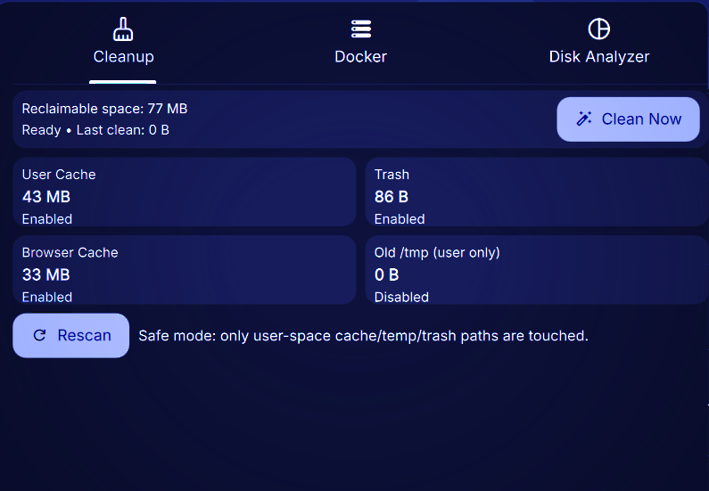
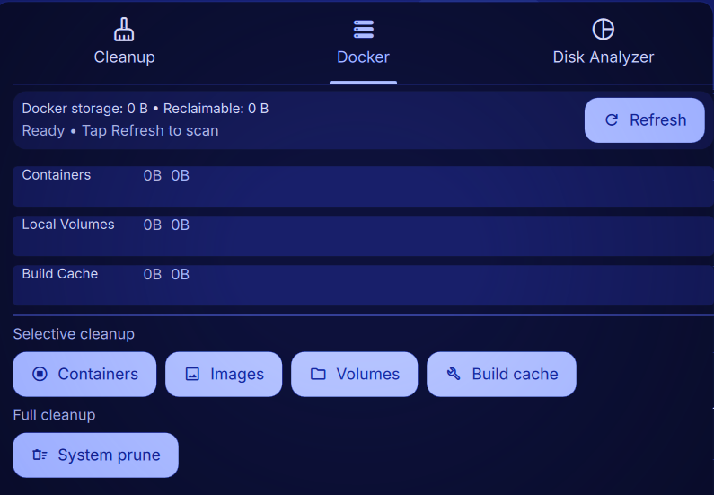
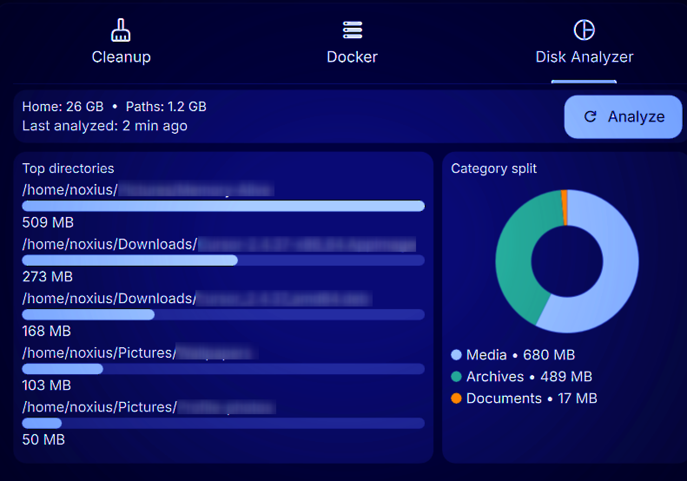

# Dank Cleaner

Safe one-click cleaner plugin for DankMaterialShell.

## Features

- One-click cleanup for safe user-space junk categories
- Reclaimable space estimation before cleanup
- **Docker tab:** Detect Docker, show storage usage (`docker system df`), one-click prune: stopped containers, unused images, volumes, build cache; full system prune with optional `-a` / `--volumes` and time filter (e.g. `until=24h`) via settings
- **Disk analyzer tab:** Home total vs configured paths total, last analyzed time, top-directory bars and category pie chart; drill-down (click a directory to view its contents, Back to go up)

If you list **overlapping** paths (e.g. `~/Downloads` and `~/Downloads/foo`), the “Paths” total can **double-count** the overlap; use disjoint roots for a precise sum.
</think>
Verifying pie Canvas repaints when buckets clear: add `onDiskTopDirsChanged` connection — optional. Checking `DankCleaner.qml` for QML `parseInt(..., 10)` validity.

<｜tool▁calls▁begin｜><｜tool▁call▁begin｜>
ReadLints

## Screenshots

- **Cleanup:** 
- **Docker:** 
- **Disk Analyzer:** 

## Safe Mode Scope

Default cleanup targets:

- `~/.cache` (excluding browser cache directories by default, plus any extra top-level names you configure — e.g. `yay` to keep yay’s VCS metadata)
- `~/.local/share/Trash/files` and `~/.local/share/Trash/info`
- Browser cache folders (if present): `~/.cache/mozilla`, `~/.cache/google-chrome`, `~/.cache/chromium`
- Optional old `/tmp` files owned by current user only

The plugin does not clean system package caches or privileged paths.

## Development

- Main branch contains stable plugin code.
- Use short-lived feature branches and open PRs into `main`.
