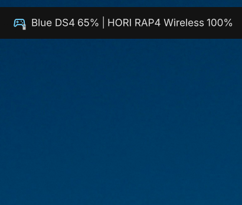

# Game Controller Battery

DankMaterialShell widget plugin that shows battery levels for connected game controllers using UPower.

## Features

- Detects controller batteries from `org.freedesktop.UPower`
- Supports multiple connected controllers
- Shows charging state and low-battery state
- Updates from D-Bus events, polling, or both
- Optional desktop notification when a controller connects
- Works in horizontal and vertical DankBar layouts

## Plugin Manifest

This plugin follows the DMS widget plugin structure documented at:

- `type: "widget"`
- `component: "./GameControllerBatteryWidget.qml"`
- `settings: "./GameControllerBatterySettings.qml"`
- `permissions: ["settings_read", "settings_write", "process"]`

The `process` permission is required because the plugin uses `notify-send` for connection notifications.

## Installation

1. Place or symlink this directory at `~/.config/DankMaterialShell/plugins/gameControllerBattery`.
2. Open DMS Settings and scan for plugins.
3. Enable `Game Controller Battery`.
4. Add it to DankBar from the widget list.

For development reloads, use:

```bash
dms ipc call plugins reload gameControllerBattery
```

Check current status with:

```bash
dms ipc call plugins status gameControllerBattery
```

## Settings

The plugin uses `PluginSettings` and exposes these settings:

| Setting                            | Type      | Default  | Description                                                     |
| ---------------------------------- | --------- | -------- | --------------------------------------------------------------- |
| Show Controller Count Only         | Toggle    | `false`  | Hides controller names and keeps the compact percentage display |
| Controller Name Length             | Slider    | `16`     | Maximum displayed controller name length                        |
| Connection Notifications           | Toggle    | `true`   | Sends a desktop notification when a controller connects         |
| Hide When No Controllers Connected | Toggle    | `false`  | Hides the widget when no controller battery is detected         |
| Update Method                      | Selection | `event`  | Chooses D-Bus events, polling, or both                          |
| Fallback Refresh Interval          | Slider    | `15 sec` | Polling interval used when polling is enabled                   |

## Detection Logic

The widget enumerates UPower devices and scores candidates using:

- Device type
- Model, native path, and icon-name keyword matching
- Valid battery percentage availability

Matching devices are de-duplicated by UPower path and sorted by score. The top match drives the overlay battery indicator, and all matched controllers are shown in the widget display.

## Requirements

- DankMaterialShell with 3rd party plugin support
- UPower running on the system bus
- Controller battery support exposed through UPower

## Screenshot



## Troubleshooting

### No controller battery appears

```bash
busctl --system list | grep org.freedesktop.UPower
upower -e
upower -i <device-path>
```

### Updates are delayed

- Switch `Update Method` to `both` or `poll`
- Lower `Fallback Refresh Interval`
- Verify your controller emits UPower property changes on your system

### Plugin loads but notifications do not appear

- Confirm `notify-send` is installed
- Keep `Connection Notifications` enabled
- Ensure the plugin manifest still includes the `process` permission

## Metadata

- Plugin ID: `gameControllerBattery`
- Name: `Game Controller Battery`
- Version: `1.0.0`
- Author: `Mohammad Hujair`
