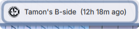
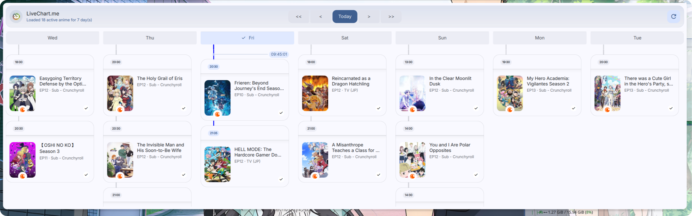
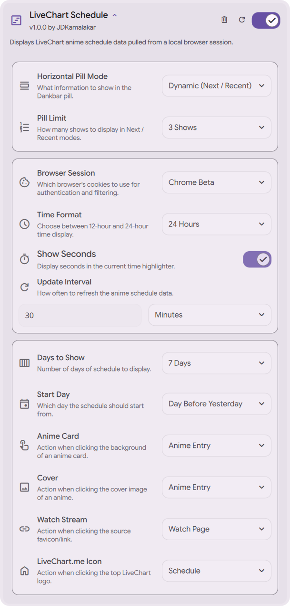

<div align="center">

<a href="https://github.com/JDKamalakar/DMS-LiveChart.me">
    
</a>

# [DMS_LiveChart.me](#)

### Seasonal Anime Tracker
Elegant implementation of the LiveChart.me Dankbar widget and slide-out panel, specifically designed for the Dank Material Shell.

[](https://github.com/Dank-Material-Shell)
[](https://github.com/DankMaterialShell)
[](https://github.com/JDKamalakar/DMS-LiveChart.me/graphs/commit-activity)

## Download

[](https://danklinux.com/plugins)


*Requires Dank Material Shell (DMS) 1.0 or higher.*

## Features

<div align="left">

* **Real-time Tracking**: Seamless integration of LiveChart.me seasonal schedules directly into your shell.
* **Dankbar Integration**: Clean, minimal status bar indicators that keep you informed about upcoming episodes.
* **Premium Pop-up UI**: A modernized, material-style interface with fluid animations, dynamic headers, and card-based layouts.
* **Smart Interaction**: Hover-driven feedback, status-aware card highlights, and sophisticated micro-animations.
* **Material Aesthetics**: Premium design tokens and transitions designed to feel native to the Dank Material Shell.
* **Customizable Experience**: Dedicated settings panel to fine-tune appearance and synchronization behavior.
* **Local Data Fetching**: Efficiently pulls data from local browser sessions for a personalized experience.

</div>

> [!IMPORTANT]  
> **Note:** Some features may be limited as there is currently no public-facing API available for LiveChart.me.

## Interface

<div align="center">
  
  
</div>

## Configuration

<div align="center">
  
</div>

## Installation

<div align="left">

### Standard Linux
Ensure you have Python 3 and the required dependencies installed:

```bash
pip install beautifulsoup4 browser-cookie3
```

> [!TIP]
> Make sure the `fetch_livechart.py` script has execution permissions:  
> `chmod +x fetch_livechart.py`

### Installing on NixOS

If you're installing the plugin on NixOS, the plugin will not work as the fetcher script won't be able to find the python dependencies it needs to work.
In order to make the plugin work, you'll need to wrap it with it's dependencies. Here's a code snippet that does it (installing the plugin with DMS' home-manager module):

<details>
<summary><b>Click to expand NixOS/Home Manager configuration</b></summary>

```nix
{
  programs.dank-material-shell.plugins.liveChartSchedule = { 
    enable = true;
    src = let
      # If you're not using the DMS plugin registry's flake, you can replace this with the plugin's source you're using.
      liveChartSchedule = inputs.dms-plugin-registry.packages.${pkgs.stdenv.hostPlatform.system}.liveChartSchedule;
    in
    lib.mkForce (pkgs.symlinkJoin {
      inherit (liveChartSchedule) pname version;

      paths = [ liveChartSchedule ];
      nativeBuildInputs = with pkgs; [
        python3Packages.wrapPython
      ];

      pythonInputs = with pkgs.python3Packages; [
        beautifulsoup4
        browser-cookie3
      ];

      postBuild = ''
        buildPythonPath "$pythonInputs"

        wrapProgram $out/fetch_livechart.py \
          --prefix PATH : $program_PATH \
          --set PYTHONHOME ${pkgs.python3} \
          --set PYTHONPATH $program_PYTHONPATH
      '';
    });
  };
}
```

</details>

Alternatively you can make the dependencies available system-wide (for example if you're not installing the plugin through your NixOS configuration), but this is not recommended and your configuration will likely fail to build.

<details>
<summary><b>Click to expand Alternative System-wide Configuration</b></summary>

```nix
  {
    # On NixOS side
    environment.systemPackages = with pkgs; [
      (python3.withPackages (ps: with ps; [
        beautifulsoup4
        browser-cookie3
      ]))
    ];

    # or on home-manager's side
    home.packages = with pkgs; [
      (python3.withPackages (ps: with ps; [
        beautifulsoup4
        browser-cookie3
      ]))
    ];
  }
  ```

</details>

</div>

## Contributing

Pull requests are welcome. For major changes, please open an issue first to discuss what you would like to change.

Before reporting a new issue, take a look at the [FAQ](https://github.com/JDKamalakar/DMS-LiveChart.me/wiki), the [changelog](https://github.com/JDKamalakar/DMS-LiveChart.me/releases) and the already opened [issues](https://github.com/JDKamalakar/DMS-LiveChart.me/issues).


### Credits

Built with ❤️ for the [Dank Material Shell](https://github.com/DankMaterialShell) community.

<a href="https://github.com/JDKamalakar/DMS-LiveChart.me/graphs/contributors">
    
</a>

### Disclaimer

This application is an independent utility and is not officially affiliated with LiveChart.me.

### 📜 License

Part of DankMaterialShell. Check the main repository for license information.

</div>
