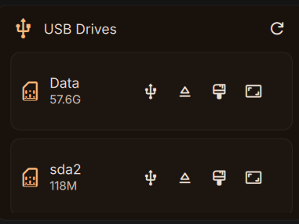
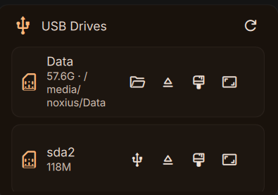
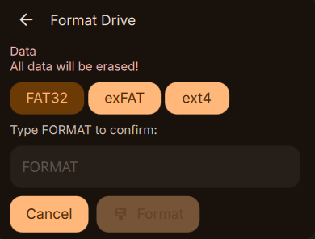
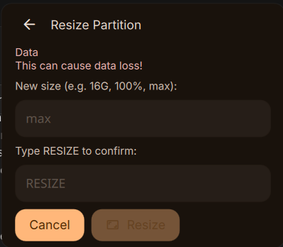

# USB Manager (DankMaterialShell)

Bar widget for removable USB drives: list devices, mount/unmount, eject, format (FAT32 / exFAT / ext4), and resize partitions. A background daemon watches `udisksctl` and shows connect/disconnect notifications.

## Screenshots

| Bar popout (device list) | Mounted drive + path |
|--------------------------|----------------------|
|  |  |

| Format flow | Resize flow |
|-------------|-------------|
|  |  |

## Requirements

- [DankMaterialShell](https://github.com/AvengeMedia/DankMaterialShell) with plugin support
- `udisks2` (`udisksctl`), `lsblk`, `bash`
- For format/resize: `parted`, `mkfs.vfat` / `mkfs.exfat` / `mkfs.ext4`, `resize2fs` (ext4), optional `fatresize` (FAT32 grow), Polkit/agent for privileged operations

## Install

### DMS Plugins UI

Settings (e.g. **Mod+,**) → **Plugins** → **Browse** → install **USB Manager** once it appears in the registry.

### Manual

```bash
git clone https://github.com/NordicsSys/dms-usb-manager.git \
  ~/.config/DankMaterialShell/plugins/USBManager
dms restart   # or reload your session
```

Enable **USB Manager** and its daemon in plugin settings.

## Repository layout

| Path | Role |
|------|------|
| `plugin.json` | Plugin manifest |
| `USBManager.qml` | Bar widget |
| `USBManagerPopout.qml` | Popout UI (list, format, resize) |
| `daemon.qml` | Background monitor + notifications + IPC |
| `main.qml` | Panel UI |
| `helpers/*.sh` | List/mount/format/resize helpers |

## Recent fixes (high level)

- Reliable plugin path resolution (`usbManager` vs `USBManager` install folder).
- NVMe / mmcblk parent-disk detection in `usb_manager.sh`.
- Mount-then-open-file-manager waits for device list refresh (no race).
- Safer format/resize: USB transport required, stricter removable sysfs checks, stderr merged for pkexec errors.
- `udisksctl monitor` restart backoff (avoids tight loops if the binary is missing).
- UI: `RowLayout` spacers, corrected widths, mount/unmount icon semantics.

## License

See [LICENSE](LICENSE).
