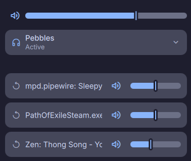

# Volume Mixer

Standalone volume mixer for [dms](https://github.com/AvengeMedia/DankMaterialShell). Control master volume, switch audio sinks, and adjust per-app playback levels from your bar.

## Install

Available live in your shell via the [DMS Plugin Registry](https://danklinux.com/plugins).

## Contributing

PRs are open.
